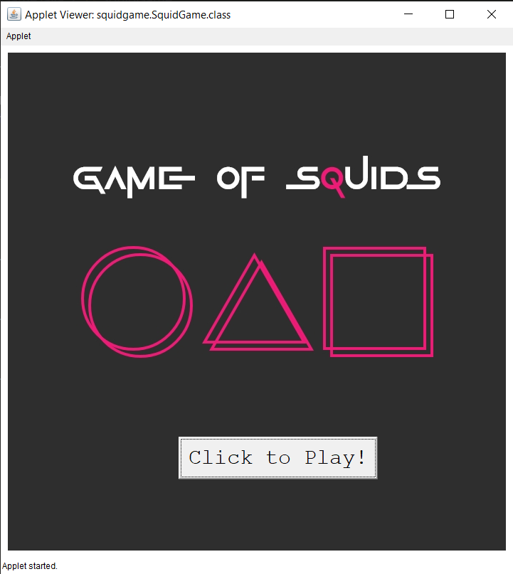
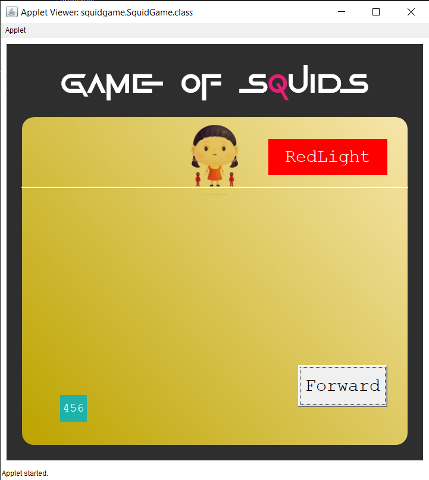

# ☕ java-applet-programs

### This project contains some of my java applet projects.

> These Programs are

## 1. Squid Games

<div style="display: flex">


</div>

Directory Location :

```
src/squidgame/SquidGame.java
```

To Run the program in Terminal use these command from project's root directory :

```
$ javac src/squidgame/SquidGame.java
$ appletviewer src/index.html
```

> Note!
>
> > Applet Programs not supported on jdk 9 and above so use jdk 8 for optimal results.

---

## contributing

You can contribute to improve this project by:

- edit the code
- creating a pull request
- submitting new ideas / features suggestions
- reporting a bug

---

### Thank You For Checking This Out 🥰🤗 Please give it a Start ⭐ if You've Liked it . . .

## And Follow Me On GitHub @[SumonRayy](https://github.com/SumonRayy/) 🙏🏻
